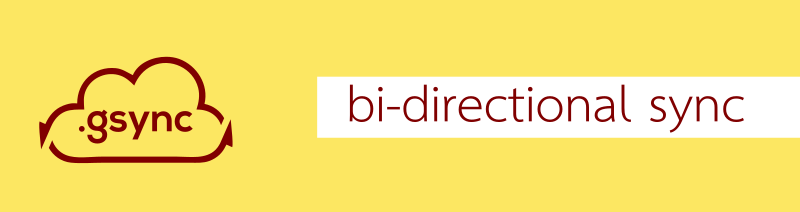

[](https://beautifuljekyll.com/plans/)

# Gsync
Implementazione di **sync bi-direzionale** tra cartelle basato su **rclone**. Il log delle operazioni, i file cancellati o sovrascritti, un mirror degli elenchi files, vengono salvati su cartelle di recupero in modo da rendere le operazioni reversibili.

# Esempio operativo
Sincronizzazione tra una cartella locale e una cartella remota su google drive, livello di status dettagliato, non cancellazione delle directory temporanee create dal processo (a scopo di debug)


## Lo script
```bash
#####################################################################
source "gsync.sh"
# two dir for bisync es: local/remote
directory_A="local:/home/aldo/Scrivania/sync test - 2/CasaZita"
directory_B="googlezita:"
# name unique for this sync (es:"bysincA-B") or "auto" for autoUUID
name_unico="auto"
# livello di status
statuslevel="0"   ;# 0- show progress/status/warning/error
                   # 1- show status/warning/error
                   # 2- show warning/error
                   # 3- show only error
# format of bytes ("readable" or "bytes")
formatnumber="readable"     
# Delete temp files ("yes"/"no") for debug
erasetemp="no"            
#####################################################################
```