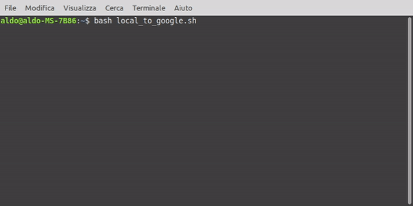
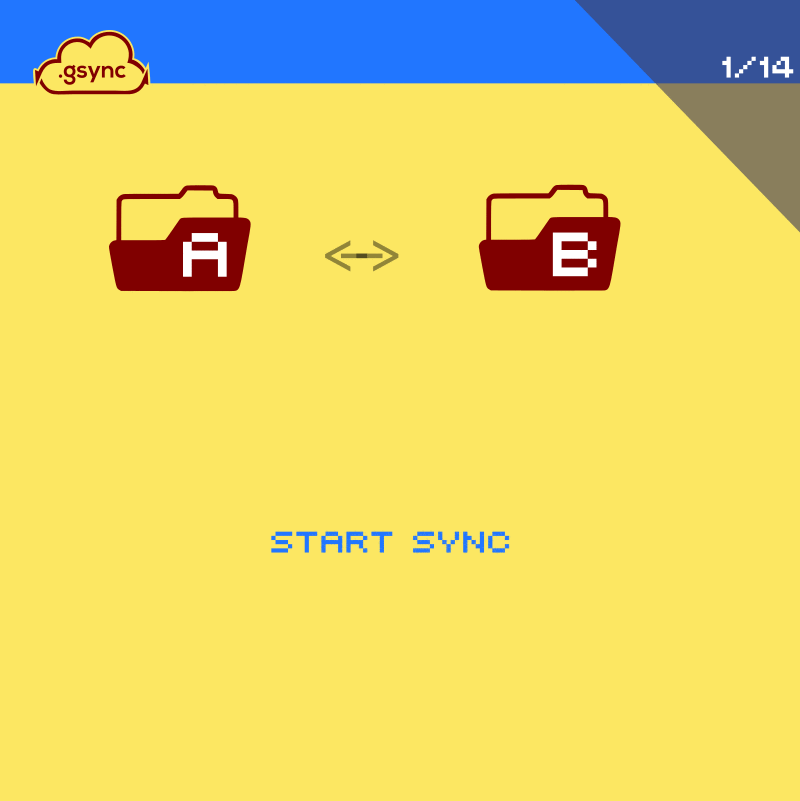
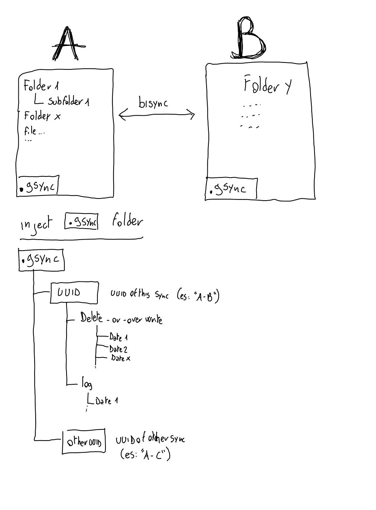

# Gsync &nbsp;&nbsp;&nbsp;&nbsp;[](README_it.md)&nbsp;&nbsp;[](README.md)

Implementation of **bi-directional sync** between folders, based on **rclone**. Allows **bi-directional sync** between: ```local folders-google drive-ftp-dropbox``` and many [others](https://rclone.org/overview/). The operation log, the deleted or overwritten files, a mirror of the files lists, are saved on "recovery folders" in order to make all operations reversible. <br> <br>

[](https://raw.githubusercontent.com/sepoina/Gsync/main/bin/gsync.sh)
[](https://creativecommons.org/licenses/by-nc/4.0/)
<br><br>

## Table of contents

- [Quick start](#quick-start)
- [Operating example](#operating-example)
- [Advanced documentation](#advanced-documentation)
- [Problem with script](#problem-with-script)
- [Thanks](#thanks)
- [Offer a coffee](#offer-a-coffee)
<br><br>

## Quick start

1. **_Download the script_** -> [gsync.sh](https://github.com/sepoin/gsync/raw/main/bin/gsync.sh) (three modes):
    - [Download only the latest release of the script](https://github.com/sepoina/Gsync/raw/main/bin/gsync.sh)
    - or [Download the whole package in zip format](https://github.com/sepoina/Gsync/archive/main.zip)
    - or clone this repository: `git clone https://github.com/sepoina/Gsync.git`

1. Install **_rclone_**
    - [Releases rclone](https://rclone.org/downloads/)
    - Attention! [tested with this release](https://beta.rclone.org/branch/fix-rmdirs-filter/v1.55.0-beta.5165.358c0832c.fix-rmdirs-filter/)
    - to test rclone install (in terminal): ```rclone --version```
    - version > v1.55.0-beta.5165.358c0832c

1. If you are using a remote cloud **_configure rclone_** for access
    - google drive [here](https://rclone.org/drive/) or [video guide](https://www.youtube.com/watch?v=f8K-V3HHDA0)
    - dropbox [here](https://rclone.org/dropbox/) 
    - ftp [here](https://rclone.org/ftp/)
    - in general [video guide](https://www.youtube.com/watch?v=G8YMspboIXs)

1. **_Create a script fallow example_** es: "```local_to_google.sh```"
    - inclusion of gsync:` source "gsync.sh"`
    - set Folder A (Origin) eg: `" Local:/Home/Aldo"`
    - set Folder B (destination) eg: `"gdrivealdo:"`
    - call ` Gsync` 
    - ( you can download example [here](example/local_to_google.sh) )
<br><br><br><br>

# Operating example

Synchronization between ``local folder`` and ``remote folder`` on google drive, ``detailed`` status level, ``delete`` temporary directories created by the process<br> <br>

### The example
- **``A``** -> is local dir "/mnt/Laboratorio/L/Backup/googlezita" (local: is necessary)<br>
- **``B``** -> remote cloud rclone [configured](https://rclone.org/drive/) google drive -> "googlezita:"<br>
- **``name``** -> a name of this sync, "auto" generate unique id<br>
- **``statuslevel``** -> "0" render stdout max (0-all message,1-progress,2-only warn,3-only error)<br>
- **``fullreport``** -> "n" not show 0 bytes dialog<br>
- **``formatnumber``** -> "readable" show number in Mb/GB format not pure bytes<br>
- **``erasetemp``** -> "y" for delete<br><br>

### the script for this example: ```local_to_google.sh```<br><br>
```bash
#!/bin/bash
source "gsync.sh"
Gsync << JSONgsync
    {    
                   "A" : "local:/mnt/Laboratorio/L/Backup/googlezita",  
                   "B" : "googlezita:",
                "name" : "auto",
         "statuslevel" : "0",
          "fullreport" : "n",
        "formatnumber" : "readable",
           "erasetemp" : "y"
    }   
JSONgsync
[[ $? -gt 0 ]] && echo "error code:$?"
```
<br>

### execution

<br><br><br><br>

# Advanced Documentation

## Phases of synchronization in an animation


## phases of synchronization in detail

The gsync phases are compartmentalized to avoid synchronization problems, you will find the reference numbers of the sub-operations in the source

1. reading the structure of the folders to be synchronized (A-B)
    - [#.1.1] creating a temporary directory locally
    - [#.1.2] check for the existence of previous synchronizations
    - [#.1.3] loading of lists from previous sync
    - [#.1.4] loading the list of the files / folders structure A
    - [#.1.5] loading the list of the files / folders structure B
1. synchronization on the list
    - [#.2.1] remove identical files from analysis (path, size, date)
    - [#.2.2] suspends the directory structure analysis
    - [#.2.3] if file is present in both, make the update date prevail
    - [#.2.4] if file present only in one folder but present in the old list has been deleted
    - [#.2.5] creates a list of files to be deleted and removes it from the new one
    - [#.2.6] ripulisce la lista files
    - [#.2.7] computes new directories
    - [#.2.8] calculates the obsolete ones
1. update of the structure
    - [#.3.1] copy the obsolete files of A into its subfolder ".gsync /../ erased"
    - [#.3.2] copy the obsolete files of B into its subfolder ".gsync /../ erased"
    - [#.3.3] copy the new files from A to B
    - [#.3.4] Copy the new files of B to a
    - [#.3.5] creates any new empty folders in A
    - [#.3.6] creates any new empty folders in B
    - [#.3.7] delete any empty folders in A
    - [#.3.8] delete any empty folders in B
1. closure of operations
    - [#.4.1] download the lists from A and B again
    - [#.4.2] if they are identical, the synchronization was successful
    - [#.4.3] Update the list mirror on A and B (.gsync folder)
    - [#.4.4] synchronization timer update (.gsync folder)
    - [#.4.5] elimination of temp
<br><br>

## directory structure

A new folder (.gsync) is created in both A and B. It will contain the operation log ("log" folder) and a folder containing the deleted files and folders ("delete-or-overwrite" folder). This will allow the reversibility of the operations.

<br><br><br><br><br>

# Problem with script

You can report problems with the script or suggest improvements [indicating them here](https://github.com/sepoina/Gsync/issues/new)
<br><br>


# Thanks
[rclone](https://rclone.org/)
<br><br>

# Offer a coffee
[](https://www.paypal.com/paypalme/giancarloghigi)