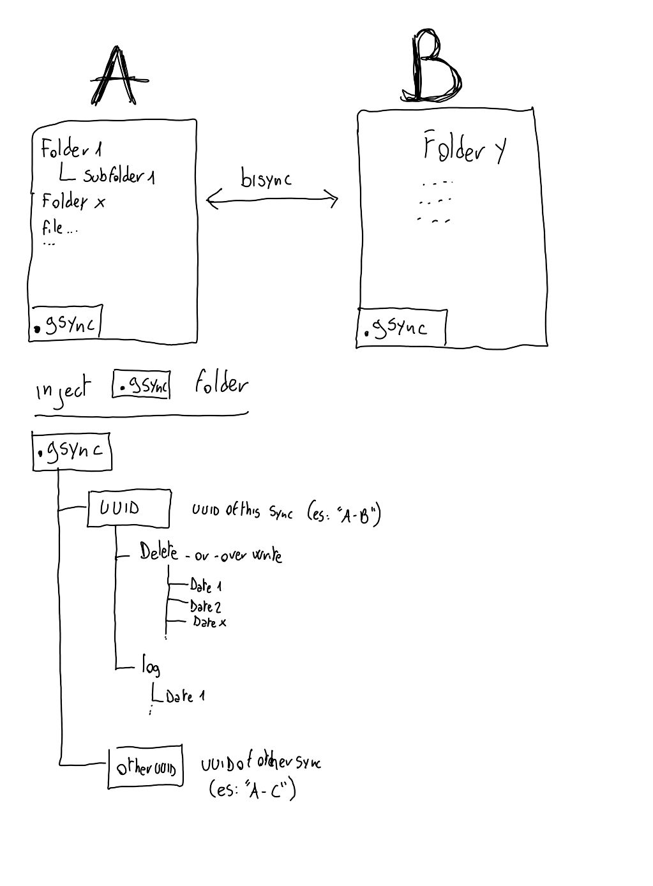

# Gsync &nbsp;&nbsp;&nbsp;&nbsp;[](README_it.md)&nbsp;&nbsp;[](README.md)

Implementazione di **sync bi-direzionale** tra cartelle basato su **rclone**. Consente il **sync bi-direzionale** tra: ```cartelle locali-google drive-ftp-dropbox``` e molti [altri](https://rclone.org/overview/). Il log delle operazioni, i file cancellati o sovrascritti, un mirror degli elenchi files, vengono salvati su cartelle di recupero in modo da rendere tutte le operazioni reversibili.<br><br>
[](https://raw.githubusercontent.com/sepoina/Gsync/main/bin/gsync.sh)[](https://creativecommons.org/licenses/by-nc/4.0/)
<br><br>

## Tabella dei contenuti

- [Quick start](#quick-start)
- [Esempio operativo](#esempio-operativo)
- [Problemi con lo script](#problemi-con-lo-script)
- [Ringraziamenti](#ringraziamenti)
- [Offri un caffè](#offri-un-caffè)
- [Documentazione avanzata](#documentazione-avanzata)
<br><br>

## Quick start
1. Scarica lo script [gsync.sh](https://github.com/sepoina/Gsync/raw/main/bin/gsync.sh) (tre modalità):

    - [Scaricare solo l'ultima release dello script](https://github.com/sepoina/Gsync/raw/main/bin/gsync.sh)
    - [Scaricare l'intero pacchetto in formato zip](https://github.com/sepoina/Gsync/archive/main.zip)
    - Clonare questo repository: `git clone https://github.com/sepoina/Gsync.git`

1. Installa rclone 
    - [Releases di rclone](https://rclone.org/downloads/)
    - Attenzione! [testato con questa release](https://beta.rclone.org/branch/fix-rmdirs-filter/v1.55.0-beta.5165.358c0832c.fix-rmdirs-filter/)

1. Se si utilizza un cloud remoto configurare rclone per l'accesso
    - google drive [qui](https://rclone.org/drive/) o [video guida](https://www.youtube.com/watch?v=f8K-V3HHDA0)
    - dropbox [qui](https://rclone.org/dropbox/) 
    - ftp [qui](https://rclone.org/ftp/)
    - in generale [video guida](https://www.youtube.com/watch?v=G8YMspboIXs)

1. Configurare uno script "backup_aldo.sh" contenente
    - inclusione di gsync:` source "gsync.sh"`
    - cartelle A (origine) es:` "local:/home/aldo"`
    - cartelle B (destinazione) es:` "gdrivealdo:"`
    - comando ` Gsync` 
<br><br><br><br>

# Esempio operativo

Sincronizzazione tra una cartella locale e una cartella remota su google drive, livello di status dettagliato, non cancellazione delle directory temporanee create dal processo (a scopo di debug) <br><br>
### La struttura delle directory
- local dir to mirror: ```/home/aldo/CasaZita```<br>
- remote dir is google drive ```home``` <br>
- execution dir contain ```gsync.sh``` and ```local_to_google.sh```<br><br>

### Lo script
```bash
#!/bin/bash
# import gsync.sh source (same directory)
source "gsync.sh"
#####################################################################
#
# config this area
#
# two dir for bisync es: local/remote
directory_A="local:/home/aldo/CasaZita"
directory_B="googlezita:"
# name unique for this sync (es:"bysincA-B") or "auto" for autoUUID
name_unico="auto"
# livello di status
statuslevel="0"   ;# 0- show progress/status/warning/error
                   # 1- show status/warning/error
                   # 2- show warning/error
                   # 3- show only error
# format of bytes ("readable" or "bytes")
formatnumber="readable"     
# Delete temp files ("yes"/"no") for debug
erasetemp="no"            
#####################################################################
Gsync 
echo "error code:$?"
```
<br>

### L'esecuzione

<br><br><br><br>

# Documentazione Avanzata
## Fasi della sincronizzazione in una animazione


## Fasi della sincronizzazione nel dettaglio
Le fasi di gsync sono compartimentate per evitare problemi di sincronizzazione, troverete nel sorgente i numeri di riferimento delle sotto-operazioni
1. lettura della struttura delle cartelle da sincronizzare (A-B)
    - [#.1.1] creazione di una directory temporanea in locale
    - [#.1.2] verifica dell'esistenza di precedenti sincronizzazioni 
    - [#.1.3] caricamento delle liste da precedenti sync
    - [#.1.4] caricamento della lista della struttura files/cartelle A
    - [#.1.5] caricamento della lista della struttura files/cartelle B
1. sincronizzazione su lista
    - [#.2.1] toglie i files identici dall'analisi (percorso,dimensione,data)
    - [#.2.2] sospende l'analisi della struttura directory
    - [#.2.3] se file presente in entrambe fai prevalere data di aggiornamento
    - [#.2.4] se file presente solo in una cartella ma presente nell'elenco vecchio è stato cancellato
    - [#.2.5] crea una lista dei file da cancellare e la rimuove da quella dei nuovi
    - [#.2.6] ripulisce la lista files
    - [#.2.7] calcola le directory nuove
    - [#.2.8] calcola quelle obsolete
1. update della struttura
    - [#.3.1] copia i file obsoleti di A in una sua sottocartella ".gsync/../erased"
    - [#.3.2] copia i file obsoleti di B in una sua sottocartella ".gsync/../erased"
    - [#.3.3] copia i nuovi file di A in B
    - [#.3.4] copia i nuovi file di B in A
    - [#.3.5] crea eventuali nuove cartelle vuote in A
    - [#.3.6] crea eventuali nuove cartelle vuote in B
    - [#.3.7] elimina eventuali cartelle vuote in A
    - [#.3.8] elimina eventuali cartelle vuote in B
1. chiusura delle operazioni
    - [#.4.1] scarica nuovamente le liste da A e B
    - [#.4.2] se sono identiche la sincronizzazione è andata a buon fine
    - [#.4.3] aggiorna il mirror di lista su A e B (cartella .gsync)
    - [#.4.4] update del timer di sincronizzazione (cartella .gsync)
    - [#.4.5] eliminazione di temp 
<br><br>

## directory structure

Una nuova cartella (.g sync) è creata sia in A che in B. Conterrà il log delle operazioni (cartella "log") e una cartella contenente i file e cartelle eliminati (cartella "delete-or-overwrite"). Questo consentirà la reversibilità delle operazioni. 

<br><br><br><br><br>

# Problemi con lo script
Puoi segnalare problemi allo script o suggerire miglioramenti [indicandoli qui](https://github.com/sepoina/Gsync/issues/new)
<br><br>

# Ringraziamenti
[rclone](https://rclone.org/)
<br><br>

# Offri un caffè
[](https://www.paypal.com/paypalme/giancarloghigi)