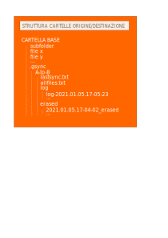

**TEST**

# Test
QUesto è un testo normaleQUesto è un testo normaleQUesto è un testo normaleQUesto è un testo normaleQUesto è un testo normaleQUesto è un testo normaleQUesto è un testo normaleQUesto è un testo normaleQUesto è un testo normaleQUesto è un testo normaleQUesto è un testo normaleQUesto è un testo normaleQUesto è un testo normaleQUesto è un testo normaleQUesto è un testo normaleQUesto è un testo normaleQUesto è un testo normaleQUesto è un testo normaleQUesto è un testo normaleQUesto è un testo normaleQUesto è un testo normaleQUesto è un testo normaleQUesto è un testo normaleQUesto è un testo normaleQUesto è un testo normaleQUesto è un testo normaleQUesto è un testo normale.

# This is an <h1> tag
## This is an <h2> tag
###### This is an <h6> tag
### <code> sd fsidj foisdjf isjd ciao </code>

*This text will be italic*
_This will also be italic_

**This text will be bold**

__This will also be bold__

_You **can** combine them

* Item 1
* Item 2
  * Item 2a
  * Item 2b
    * Item 2a
    * Item 2b

1. Item 1
1. Item 2
1. Item 3
   1. Item 3a
   1. Item 3b



As Kanye West said:

```
#######################################################################################################################
source "gsync.sh"
# two dir for bisync
directory_A="local:/home/aldo/Scrivania/sync test - 2/CasaZita"
directory_B="googlezita:"
# name unique for this sync (es:"bysincA-B") or "auto" for generated name
name_unico="auto"
# livello di status
statuslevel="0"             ;# 0- progress/status/warning/error
                            # 1- status/warning/error
                            # 2- warning/error
                            # 3- only error
# format of bytes ("readable" or "bytes")
formatnumber="readable"     
# Delete temp files ("yes"/"no") for debug
erasetemp="no"            
#######################################################################################################################
We're living the future so<br> the present is our past.
```

- [x] @mentions, #refs, [links](), **formatting**, and <del>tags</del> supported
- [x] list syntax required (any unordered or ordered list supported)
- [x] this is a complete item
- [ ] this is an incomplete item

First Header | Second Header
------------ | -------------
Content from cell 1 | Content from cell 2
Content in the first column | Content in the second column

16c999e8c71134401a78d4d46435517b2271d6ac
mojombo@16c999e8c71134401a78d4d46435517b2271d6ac
mojombo/github-flavored-markdown@16c999e8c71134401a78d4d46435517b2271d6ac

#1
mojombo#1
mojombo/github-flavored-markdown#1

:grinning:

Migliora mento
Inizia la modifica
Qui cambio qualcosa ancora